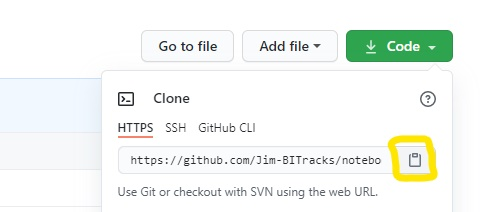
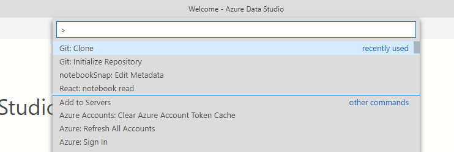
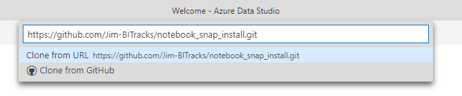
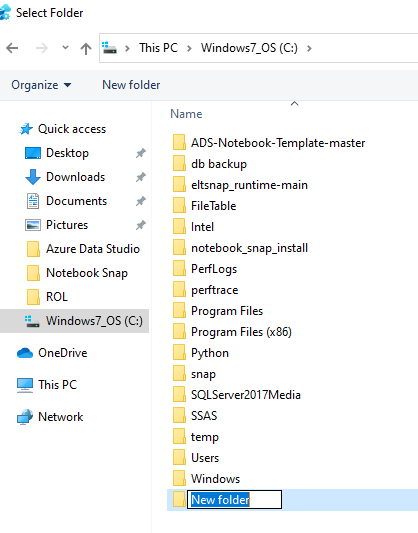
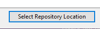
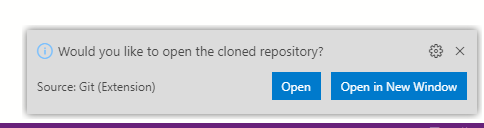

# Installing ADS Extensions: Notebook Snap, ELT Snap

Instructions to install an extension with Azure Data Studio

1. From GitHub, click the "Code" menu:

2. Open Azure Data Studio, press F1, type in Git Clone and select:

3. Paste the URL from GitHub:

4. Create a folder to be the repository location:

5. Click "Select Repository Location:"

6. Choose "Open:"

