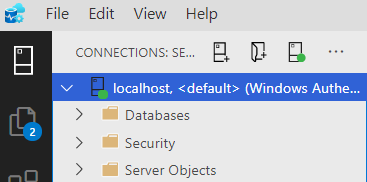
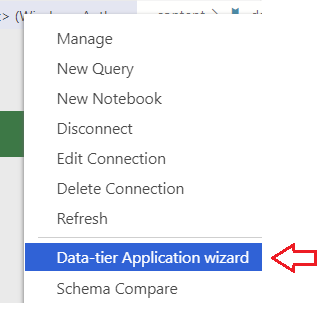
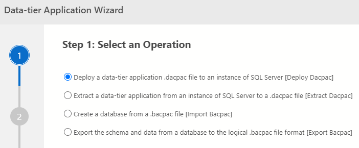
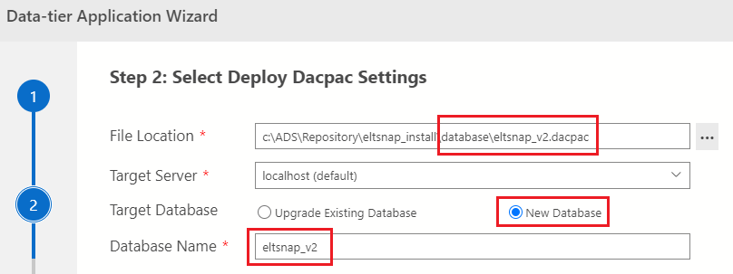
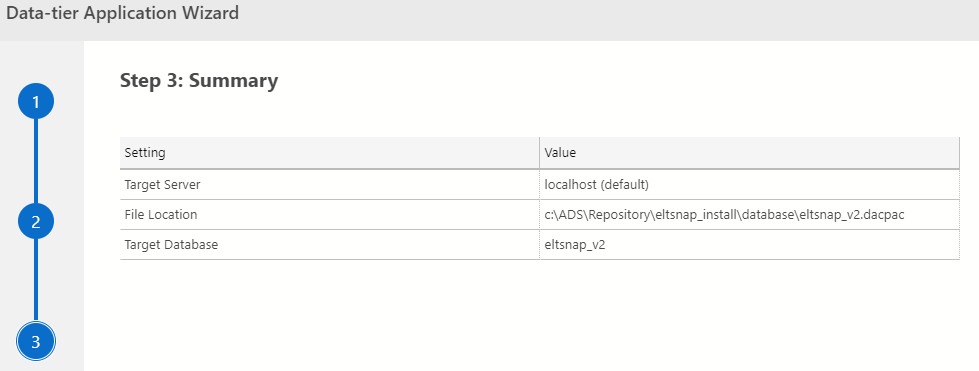
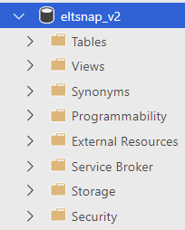

# Deploying a .dacpac File

Instructions to deploy a **.dacpac** file to SQL Server with Azure Data Studio

> In this example we will deploy the **eltsnap_v2** database

1. Connect to the destination SQL Server in Azure Data Studio:

2. Right Click on the connection and choose "Data-tier Application wizard:

3. In the Wizard, choose the first option (Deploy):

4. Click 'Next'

5. Set deployment options:
    - Select the file **eltsnap_v2.dacpac** located under the **database** folder
    - Choose 'New Database'
    - Verify the Database Name of 'eltsnap_v2'

6. Click 'Next'

7. Review the deployment summary:

8. Click 'Deploy'

The database should now be deployed, and visible as a Database on your SQL Server instance:

