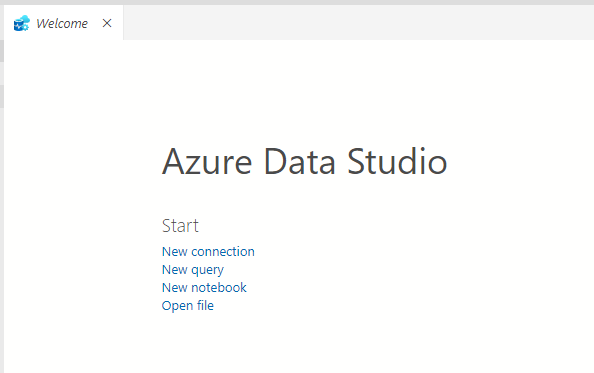
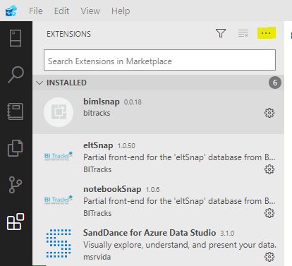
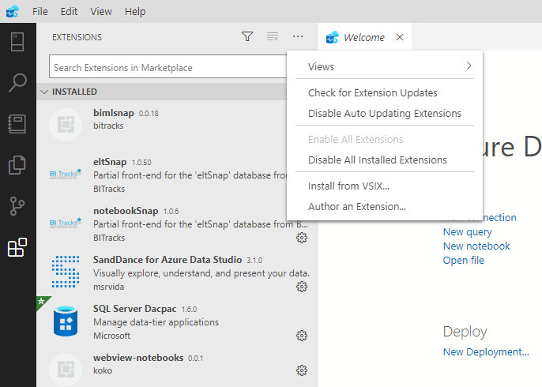
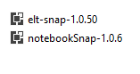

# Installing ADS Extensions: Notebook Snap, ELT Snap

Instructions to install an extension with Azure Data Studio

1. Open Azure Data Studio:

2. Go to Extensions (Ctrl + Shift + X):

3. Click the ... icon and choose Install from VSIX:

4. Navigate to the notebook_snap_install\extension folder.

5. Choose notebookSnap.vsix

6. Repeat steps for eltSnap.vsix