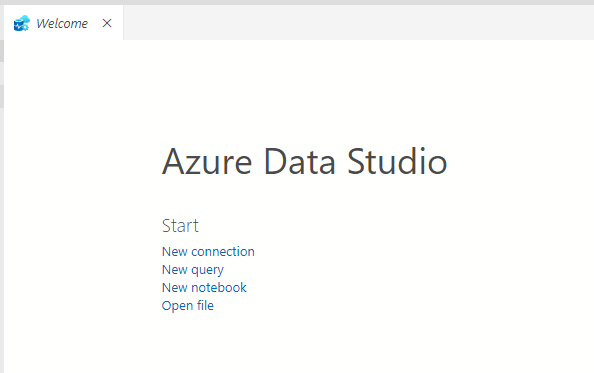

# Opening Notebooks in Azure Data Studio

Instructions to open a notebook with Azure Data Studio

1. Open Azure Data Studio:

2. Click File, Open File...:

3. Navigate to the location where notebook_snap_install was cloned:

4. Go to the notebook_snap_install\content folder.

5. Choose the ipynb file.

