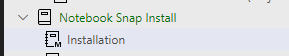

# Notebook Snap Installation Instructions

> Usage of this product confirms your agreement to the following 'Indemnification', and 'Liability disclaimer':

Indemnification: You agree to indemnify, defend and hold harmless BI Tracks, its officers, directors, employees, agents and third parties, for any losses, costs, liabilities and expenses relating to or arising out of your use of or inability to use BI Track's Services, Programs, or any related software services.

See: [Liability disclaimer](liability_disclaimer.md) for details

## System Requirements (all 64-bit):
- Windows 10 or Windows Server 2016 (or later)
- SQL Server 2019 (or later) Express, Standard, or Enterprise Edition
- PowerShell Core 7.1.2 (or later)
- Azure Data Studio

**Important**: Verify "PowerShell Requirements" using notebook: [Local System Configuration](system_configuration.ipynb)

## Installation Steps:

**Step 1** - *Note: Perform this step only if you have not already **cloned** the repository "notebook_snap_install"*.

Clone repository "notebook_snap_install" from GitHub (using Azure Data Studio). If you need help with repository cloning see: [Cloning with Azure Data Studio](clone_instructions.md)

**Step 2** - *Note: You can skip this step if you are already viewing this notebook in Azure Data Studio*.

Open Install Instructions in ADS.

From ADS, click on the notebook icon:


Open the Installation notebook under "Notebook Snap Install"



**Step 3** - Install the following extension:
- eltsnap

See: [Installing ADS Extensions](install_extensions.md) for step-by-step instructions.

> Note: for the next step, in order to *Import* .**Bacpac** files with Azure Data Studio, you will need to install the *extension*: **SQL Server Dacpac**

**Step 4** - Import the following two .Bacpac (data-tier application) files to a SQL Server Instance:
- eltsnap_v2
- elt_framework

To Import these 2 databases:

- connect to your target server
- right click on the Server listed in the side bar
- choose: "Data-tier Application wizard"

Note: the 2 .bacpac files can be found in the current repository under the 'database' folder.


**Step 5** - **Clone** and *Configure* the **eltSnap Runtime** GitHub Repository: [eltSnap Runtime](https://github.com/Jim-BITracks/eltsnap_runtime), and then return to this repository to complete the steps below.

**Step 6** - Test the eltSnap runtime by pasting the following command into the Terminal Window (you may need to update the **-server** parameter "localhost" below to specify your SQL Server instance name):

``` powershell
eltsnap_runtime_v2 -server "localhost" -database "eltsnap_v2" -project "Database Log Clean-up"
```

**Step 7** - (Optional) Sample eltSnap projects are available in GitHub Repository: [Notebook Snap Basics](https://github.com/Jim-BITracks/notebook_snap_basics)